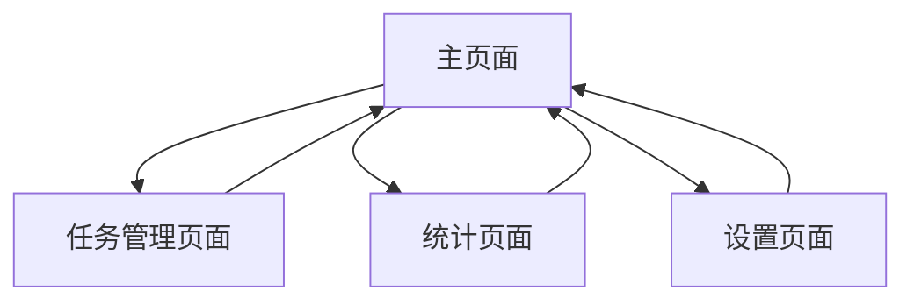

# 习惯追踪应用产品需求文档

## 1. 产品概述
一个帮助用户培养良好习惯的网页应用，通过游戏化的积分和等级系统激励用户坚持完成日常任务。
用户可以设置必做和可选任务，通过完成任务获得积分和成就感，配合酷炫动画提升使用体验。

## 2. 核心功能

### 2.1 用户角色
本应用采用单用户模式，无需注册登录，所有数据存储在本地浏览器中。

### 2.2 功能模块
我们的习惯追踪应用包含以下主要页面：
1. **主页面**：任务列表展示、快速勾选、积分显示、等级展示
2. **任务管理页面**：添加任务、编辑任务、设置难度、任务分类
3. **统计页面**：历史记录、完成率统计、积分趋势
4. **设置页面**：应用设置、数据管理、等级规则说明

### 2.3 页面详情

| 页面名称 | 模块名称 | 功能描述 |
|---------|---------|----------|
| 主页面 | 任务列表 | 显示当日所有任务，区分必做和可选任务，支持快速勾选完成 |
| 主页面 | 积分显示 | 实时显示当前积分、今日获得积分、连续完成天数 |
| 主页面 | 等级系统 | 显示当前等级、经验条、下一等级所需积分 |
| 主页面 | 动画效果 | 勾选任务时播放粒子效果、积分飞入动画、等级提升特效 |
| 任务管理页面 | 任务创建 | 添加新任务，设置任务名称、描述、难度等级、任务类型 |
| 任务管理页面 | 任务编辑 | 修改现有任务信息，删除任务，调整任务优先级 |
| 任务管理页面 | 难度设置 | 设置1-5星难度，难度越高完成后获得积分越多 |
| 统计页面 | 历史记录 | 查看过往完成记录，按日期筛选，显示完成状态 |
| 统计页面 | 数据统计 | 显示完成率、平均积分、最佳连续记录等统计信息 |
| 设置页面 | 数据管理 | 导出数据、清空数据、重置积分等功能 |
| 设置页面 | 系统设置 | 调整动画效果开关、音效设置、主题切换 |

## 3. 核心流程

用户首次进入应用时，系统引导创建第一个习惯任务。用户可以设置任务名称、选择难度等级（1-5星）、标记为必做或可选任务。

日常使用流程：用户打开应用查看当日任务列表，点击勾选完成的任务（支持重复勾选），系统播放动画效果并增加相应积分。未完成的必做任务在当日结束时自动扣分。

积分累积到一定数量时自动升级，触发升级动画和音效。用户可以在统计页面查看历史完成情况和数据分析。

## 4. 用户界面设计

### 4.1 设计风格
- 主色调：渐变蓝色(#4F46E5)到紫色(#7C3AED)，辅助色为绿色(#10B981)表示完成状态
- 按钮样式：圆角按钮配合阴影效果，点击时有缩放动画
- 字体：主标题使用18px粗体，正文使用14px常规字体，数字使用等宽字体
- 布局风格：卡片式设计，顶部导航栏，主要内容区域采用网格布局
- 动画风格：使用粒子效果、弹性动画、渐变过渡，配合适当的音效反馈

### 4.2 页面设计概览

| 页面名称 | 模块名称 | UI元素 |
|---------|---------|--------|
| 主页面 | 任务列表 | 卡片式任务项，左侧圆形勾选框，右侧星级难度显示，完成时有划线效果和绿色背景 |
| 主页面 | 积分显示 | 顶部横幅显示当前积分，使用大号数字和金色图标，积分变化时有数字滚动动画 |
| 主页面 | 等级系统 | 圆形头像框显示等级，下方进度条显示经验值，升级时有光效动画 |
| 任务管理页面 | 任务表单 | 简洁的输入框和下拉选择器，星级选择使用可点击的星星图标 |
| 统计页面 | 图表展示 | 使用柱状图和折线图展示数据，配合渐变色彩和悬停效果 |
| 设置页面 | 设置选项 | 开关按钮使用滑动动画，列表项有分割线和图标 |

### 4.3 响应式设计
应用采用移动优先的响应式设计，在手机端提供最佳体验，同时适配平板和桌面设备。支持触摸手势操作，如滑动删除任务等。