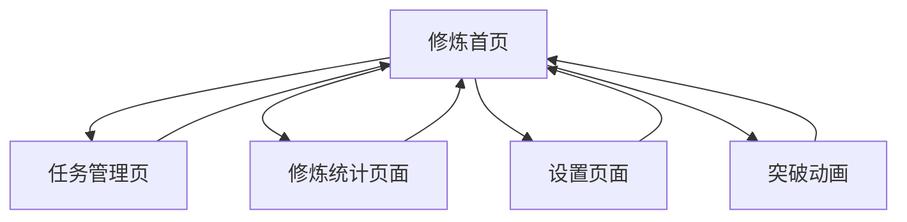

# 习惯追踪应用完整需求文档

## 1. 产品概述

本项目是一个现代化的习惯追踪应用，帮助用户建立和维持良好的日常习惯。应用采用游戏化设计理念，通过修为值、境界、血量等RPG元素激励用户坚持完成任务，并融入修仙主题为用户提供沉浸式的成长体验。

* 核心目标：通过修仙主题的游戏化机制帮助用户养成良好习惯，提供直观的进度追踪和成就反馈

* 目标用户：希望改善生活习惯、需要激励机制的个人用户，特别是喜欢修仙文化的用户群体

* 产品价值：提供有趣且有效的习惯养成工具，通过修仙RPG元素增强用户粘性和代入感

## 2. 核心功能

### 2.1 用户角色

本应用采用单用户模式，无需注册登录，所有数据存储在本地。

| 角色   | 访问方式   | 核心权限                    |
| ---- | ------ | ----------------------- |
| 修仙者 | 直接访问应用 | 可创建、编辑、完成任务，查看统计数据，管理设置 |

### 2.2 功能模块

我们的修仙主题习惯追踪应用包含以下主要页面：

1. **修炼首页**：修仙者状态显示、修炼任务列表、快速操作
2. **任务管理页**：修炼任务创建、编辑、删除功能
3. **修炼统计页面**：数据可视化、历史记录、成就展示
4. **设置页面**：应用配置、数据管理、测试功能

### 2.3 页面详情

| 页面名称  | 模块名称   | 功能描述                           |
| ----- | ------ | ------------------------------ |
| 修炼首页    | 修仙者状态区域 | 显示修仙者头像、境界、总修为值、血量条、境界进度条        |
| 修炼首页    | 修炼任务列表   | 展示今日修炼任务，支持标记完成，显示任务类型（必做/可选）和星级 |
| 修炼首页    | 突破动画   | 修炼任务完成时触发粒子效果和修为值动画               |
| 任务管理页 | 任务创建   | 创建新修炼任务，设置名称、描述、类型、星级            |
| 任务管理页 | 任务编辑   | 修改现有修炼任务的各项属性                    |
| 任务管理页 | 任务删除   | 删除不需要的修炼任务                       |
| 修炼统计页面  | 数据图表   | 显示完成率、连胜记录、修为值趋势等可视化数据          |
| 修炼统计页面  | 历史记录   | 查看过往修炼任务完成情况                     |
| 设置页面  | 应用设置   | 配置应用行为和偏好                      |
| 设置页面  | 数据管理   | 导入导出数据，重置应用                    |
| 设置页面  | 测试功能   | 惩罚系统测试按钮                       |

## 3. 核心流程

### 主要用户操作流程：

1. **日常修炼流程**：修仙者打开应用 → 查看今日修炼任务 → 完成任务并标记 → 获得修为值和经验 → 查看境界提升

2. **任务管理流程**：进入任务管理页 → 创建新修炼任务 → 设置任务属性 → 保存任务 → 返回修炼首页

3. **数据查看流程**：进入修炼统计页面 → 查看完成率图表 → 查看历史记录 → 分析修炼进度

4. **惩罚机制流程**：系统检测未完成必做任务 → 自动扣除血量 → 显示警告状态 → 修仙者完成任务恢复血量

## 4. 用户界面设计

### 4.1 设计风格

* **主色调**：蓝色系（#3B82F6）和绿色系（#10B981），传达修仙意境的仙气感觉

* **辅助色**：红色（#EF4444）用于血量和警告，金色用于高级境界，紫色用于神秘感

* **按钮样式**：圆角设计，支持悬停和点击效果，体现修仙风格

* **字体**：系统默认字体，标题使用较大字号体现威严，正文使用适中字号

* **布局风格**：卡片式布局，清晰的视觉层次，融入修仙元素

* **图标风格**：简洁的线性图标和修仙相关emoji表情

### 4.2 页面设计概览

| 页面名称  | 模块名称   | UI元素                                 |
| ----- | ------ | ------------------------------------ |
| 修炼首页    | 修仙者状态区域 | 白色卡片容器，圆形头像，境界徽章，血量条（红色渐变），进度条（蓝色渐变） |
| 修炼首页    | 修炼任务列表   | 卡片式任务项，星级显示，完成按钮，类型标签                |
| 修炼首页    | 动画效果   | 粒子爆炸效果，修为值飞入动画，使用React Portal渲染       |
| 任务管理页 | 表单界面   | 输入框，下拉选择，星级选择器，保存按钮                  |
| 修炼统计页面  | 图表区域   | 响应式图表，数据卡片，颜色编码                      |
| 设置页面  | 设置项    | 开关按钮，操作按钮，说明文字                       |

### 4.3 响应式设计

应用采用移动优先的响应式设计，在桌面端和移动端都能提供良好的用户体验。支持触摸交互优化，确保在各种设备上都能流畅使用。

## 5. 修仙主题游戏化元素

### 5.1 修为值系统

* **获得修为值**：完成修炼任务根据星级获得5-25修为值

* **修为值用途**：用于境界提升和成就解锁

* **显示方式**：实时更新，完成任务时有动画效果

### 5.2 修仙境界体系

应用采用完整的修仙境界体系，共9个主要境界，每个境界分为初期、中期、后期三个阶段，总计27个等级：

#### 境界列表：

1. **炼气期**（初期、中期、后期）- 修仙入门境界
2. **筑基期**（初期、中期、后期）- 奠定修仙基础
3. **金丹期**（初期、中期、后期）- 凝聚金丹
4. **元婴期**（初期、中期、后期）- 孕育元婴
5. **化神期**（初期、中期、后期）- 神识化形
6. **合体期**（初期、中期、后期）- 天人合一
7. **大乘期**（初期、中期、后期）- 大道圆满
8. **渡劫期**（初期、中期、后期）- 渡过天劫
9. **登仙期**（初期、中期、后期）- 飞升成仙

#### 境界特色：

* **境界计算**：基于总修为值，不同境界需要不同修为值门槛
* **境界显示**：头像旁显示境界名称和进度条
* **境界效果**：不同境界有独特的配色方案和称号
* **突破动画**：境界提升时触发特殊突破动画和音效

#### 境界配色方案：

| 境界 | 主色调 | 寓意 |
|------|--------|------|
| 炼气期 | 灰色系 | 初学者的朴素 |
| 筑基期 | 棕色系 | 稳固的基础 |
| 金丹期 | 金色系 | 金丹的光辉 |
| 元婴期 | 蓝色系 | 元婴的神秘 |
| 化神期 | 紫色系 | 神识的高贵 |
| 合体期 | 青色系 | 天人合一 |
| 大乘期 | 橙色系 | 大道圆满 |
| 渡劫期 | 红色系 | 天劫的威严 |
| 登仙期 | 彩虹渐变 | 仙境的绚烂 |

### 5.3 RPG血量系统

* **初始血量**：新修仙者默认100点血量

* **血量扣除**：未完成必做修炼任务根据星级扣除5-25点血量

* **血量恢复**：完成任务根据难度恢复血量（难度×2）

* **血量上限**：最大100点

* **警告机制**：血量低于30时显示警告状态

### 5.4 惩罚机制

* **触发条件**：必做修炼任务未在当天完成

* **惩罚方式**：扣除血量，可能导致境界下降

* **检查时机**：应用启动时自动检查

* **测试功能**：设置页面提供手动测试按钮

## 6. 特殊功能需求

### 6.1 动画效果

* **修炼完成动画**：粒子爆炸效果，从任务位置向修仙者状态区域飞散

* **修为值动画**：修为值数字从任务位置飞向总修为值显示区域

* **突破动画**：境界提升时的特殊光效和粒子效果

* **技术实现**：使用React Portal确保动画不被容器限制

### 6.2 数据持久化

* **存储方式**：本地localStorage存储

* **数据结构**：修炼任务、完成记录、修仙者数据分别存储

* **备份功能**：支持数据导出和导入

### 6.3 测试功能

* **惩罚系统测试**：手动触发昨天的惩罚检查

* **数据重置**：清空所有数据重新开始修仙之路

* **调试信息**：显示详细的扣分和恢复记录

## 7. 修仙主题优化详情

### 7.1 术语更新

| 原术语 | 修仙术语 | 说明 |
|--------|----------|------|
| 积分 | 修为值 | 体现修炼成果 |
| 等级 | 境界 | 修仙境界层次 |
| 升级 | 突破 | 境界突破 |
| 任务 | 修炼任务 | 日常修炼内容 |
| 用户 | 修仙者 | 使用者身份 |
| 经验值 | 修为值 | 修炼经验 |

### 7.2 UI文本修仙化

* 所有界面文本都采用修仙主题用词
* 按钮文字体现修仙风格（如"开始修炼"、"查看修为"等）
* 提示信息使用修仙术语
* 成就和称号体现修仙文化

### 7.3 修为值需求重新平衡

* 根据27个境界重新设计修为值需求曲线
* 确保每个境界阶段都有合适的挑战性
* 平衡修炼任务奖励与境界提升需求

### 7.4 视觉设计修仙化

* 界面配色体现修仙意境
* 图标和装饰元素融入修仙元素
* 动画效果体现修仙特色
* 字体和排版营造修仙氛围

## 8. 技术实现要点

### 8.1 日期显示逻辑

应用中的日期显示（如"今天"、"昨天"）基于以下逻辑：

* **formatDate函数**：位于Home.tsx中，负责格式化日期显示
* **判断逻辑**：
  - 如果selectedDate与当前日期相同，显示"今天"
  - 如果selectedDate是昨天的日期，显示"昨天"
  - 其他情况显示具体日期（如"1月15日 周一"）
* **selectedDate来源**：来自useAppStore中的状态，可通过DebugPanel进行模拟调整
* **实时更新**：当selectedDate改变时，显示会自动更新

### 8.2 调试功能

* **日期模拟**：DebugPanel允许模拟不同日期进行测试
* **状态监控**：实时显示当前选中日期与真实日期的偏移
* **重置功能**：可以快速回到真实时间

这种设计确保了应用在不同时间场景下的正确显示，同时提供了强大的调试能力。