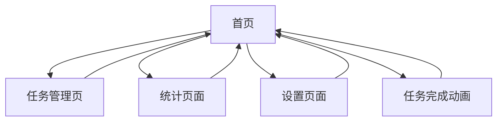

# 习惯追踪应用需求文档

## 1. 产品概述

本项目是一个现代化的习惯追踪应用，帮助用户建立和维持良好的日常习惯。应用采用游戏化设计理念，通过积分、等级、血量等RPG元素激励用户坚持完成任务。

* 核心目标：通过游戏化机制帮助用户养成良好习惯，提供直观的进度追踪和成就反馈

* 目标用户：希望改善生活习惯、需要激励机制的个人用户

* 产品价值：提供有趣且有效的习惯养成工具，通过RPG元素增强用户粘性

## 2. 核心功能

### 2.1 用户角色

本应用采用单用户模式，无需注册登录，所有数据存储在本地。

| 角色   | 访问方式   | 核心权限                    |
| ---- | ------ | ----------------------- |
| 默认用户 | 直接访问应用 | 可创建、编辑、完成任务，查看统计数据，管理设置 |

### 2.2 功能模块

我们的习惯追踪应用包含以下主要页面：

1. **首页**：用户状态显示、任务列表、快速操作
2. **任务管理页**：任务创建、编辑、删除功能
3. **统计页面**：数据可视化、历史记录、成就展示
4. **设置页面**：应用配置、数据管理、测试功能

### 2.3 页面详情

| 页面名称  | 模块名称   | 功能描述                           |
| ----- | ------ | ------------------------------ |
| 首页    | 用户状态区域 | 显示用户头像、等级、总积分、血量条、等级进度条        |
| 首页    | 任务列表   | 展示今日任务，支持标记完成，显示任务类型（必做/可选）和星级 |
| 首页    | 完成动画   | 任务完成时触发粒子效果和积分动画               |
| 任务管理页 | 任务创建   | 创建新任务，设置名称、描述、类型、星级            |
| 任务管理页 | 任务编辑   | 修改现有任务的各项属性                    |
| 任务管理页 | 任务删除   | 删除不需要的任务                       |
| 统计页面  | 数据图表   | 显示完成率、连胜记录、积分趋势等可视化数据          |
| 统计页面  | 历史记录   | 查看过往任务完成情况                     |
| 设置页面  | 应用设置   | 配置应用行为和偏好                      |
| 设置页面  | 数据管理   | 导入导出数据，重置应用                    |
| 设置页面  | 测试功能   | 惩罚系统测试按钮                       |

## 3. 核心流程

### 主要用户操作流程：

1. **日常使用流程**：用户打开应用 → 查看今日任务 → 完成任务并标记 → 获得积分和经验 → 查看等级提升

2. **任务管理流程**：进入任务管理页 → 创建新任务 → 设置任务属性 → 保存任务 → 返回首页

3. **数据查看流程**：进入统计页面 → 查看完成率图表 → 查看历史记录 → 分析习惯养成进度

4. **惩罚机制流程**：系统检测未完成必做任务 → 自动扣除血量 → 显示警告状态 → 用户完成任务恢复血量

## 4. 用户界面设计

### 4.1 设计风格

* **主色调**：蓝色系（#3B82F6）和绿色系（#10B981），传达积极向上的感觉

* **辅助色**：红色（#EF4444）用于血量和警告，灰色用于次要信息

* **按钮样式**：圆角设计，支持悬停和点击效果

* **字体**：系统默认字体，标题使用较大字号，正文使用适中字号

* **布局风格**：卡片式布局，清晰的视觉层次

* **图标风格**：简洁的线性图标和emoji表情

### 4.2 页面设计概览

| 页面名称  | 模块名称   | UI元素                                 |
| ----- | ------ | ------------------------------------ |
| 首页    | 用户状态区域 | 白色卡片容器，圆形头像，等级徽章，血量条（红色渐变），进度条（蓝色渐变） |
| 首页    | 任务列表   | 卡片式任务项，星级显示，完成按钮，类型标签                |
| 首页    | 动画效果   | 粒子爆炸效果，积分飞入动画，使用React Portal渲染       |
| 任务管理页 | 表单界面   | 输入框，下拉选择，星级选择器，保存按钮                  |
| 统计页面  | 图表区域   | 响应式图表，数据卡片，颜色编码                      |
| 设置页面  | 设置项    | 开关按钮，操作按钮，说明文字                       |

### 4.3 响应式设计

应用采用移动优先的响应式设计，在桌面端和移动端都能提供良好的用户体验。支持触摸交互优化，确保在各种设备上都能流畅使用。

## 5. 游戏化元素

### 5.1 积分系统

* **获得积分**：完成任务根据星级获得5-25积分

* **积分用途**：用于等级提升和成就解锁

* **显示方式**：实时更新，完成任务时有动画效果

### 5.2 等级系统

* **等级计算**：基于总积分，每100积分提升一级

* **等级显示**：头像旁显示等级数字和进度条

* **等级效果**：不同等级有不同的头像和称号

### 5.3 RPG血量系统

* **初始血量**：新用户默认100点血量

* **血量扣除**：未完成必做任务根据星级扣除5-25点血量

* **血量恢复**：完成任务根据难度恢复血量（难度×2）

* **血量上限**：最大100点

* **警告机制**：血量低于30时显示警告状态

### 5.4 惩罚机制

* **触发条件**：必做任务未在当天完成

* **惩罚方式**：扣除血量，可能导致等级下降

* **检查时机**：应用启动时自动检查

* **测试功能**：设置页面提供手动测试按钮

## 6. 特殊功能需求

### 6.1 动画效果

* **任务完成动画**：粒子爆炸效果，从任务位置向用户状态区域飞散

* **积分动画**：积分数字从任务位置飞向总积分显示区域

* **技术实现**：使用React Portal确保动画不被容器限制

### 6.2 数据持久化

* **存储方式**：本地localStorage存储

* **数据结构**：任务、完成记录、用户数据分别存储

* **备份功能**：支持数据导出和导入

### 6.3 测试功能

* **惩罚系统测试**：手动触发昨天的惩罚检查

* **数据重置**：清空所有数据重新开始

* **调试信息**：显示详细的扣分和恢复记录

